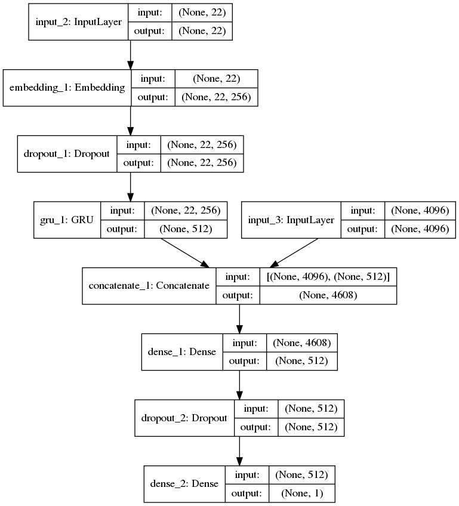
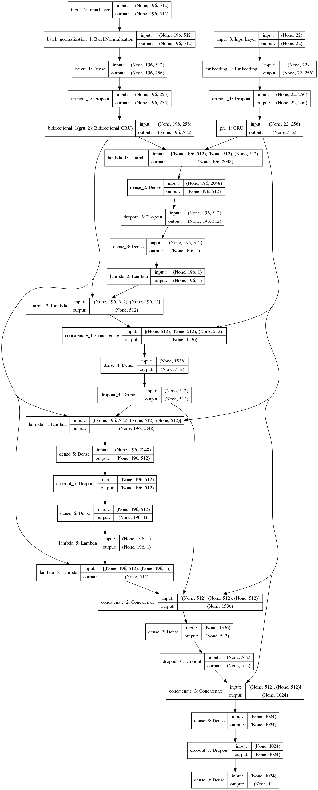
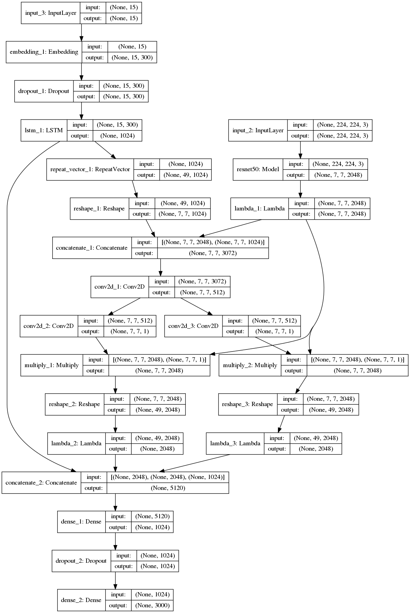

# visualqa

[TOC]

## 需要的包
1. numpy
2. pandas
3. keras
4. pickle
5. skimage
6. json
7. tensorflow

## 网络结构
### baseline model
模型结构：

参考论文：[Simple Baseline for Visual Question Answering](https://arxiv.org/pdf/1512.02167.pdf)
### DMN+

参考论文：[Dynamic Memory Networks for Visual and Textual Question Answering](https://arxiv.org/pdf/1603.01417.pdf)
### strong baseline model

参考论文：[Show, Ask, Attend, and Answer:A Strong Baseline For Visual Question Answering](https://arxiv.org/pdf/1704.03162.pdf)
## 数据来源

## 精度比较

## 结果呈现

## 参考文献
[1]