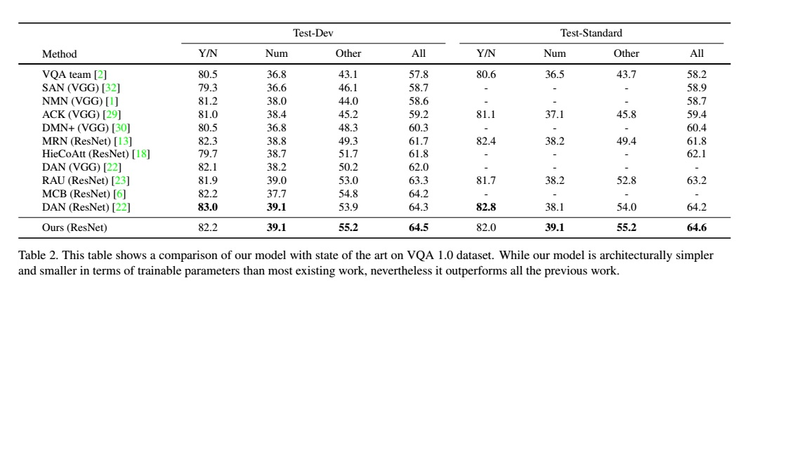

# visualqa
本项目意在钻研VQA问题在当前学术界的前沿解决方案。通过阅读英文文献，本文提取了三个模型，并基于keras框架对他们进行实现。他们采用相同的数据集
和一致的数据预处理方案。受限于笔者计算机的计算能力，更细致的调参有待于进一步的工作。

在coco数据集中，每张图片会被提出三个问题，每个问题有10个回答。coco2014数据集中共包含248349对(图片，问题，回答)这样的三元组。对于每一个问题，
我们将选择答案次数最多的作为最终回答。最终，我们将选择出现频率最高的3000类回答作为最终的分类。而不在这3000中分类中的答案最终不会计算损失函数。
另外，由于有的回答单词个数多于1个，我们也将采用两种编码方式。一种是过滤掉单词个数多于1的回答，另一种则将回答编码成一串序列。前者最终是softmax分类问题,而后者则对应于seq2sqe问题。
对于问题进行解析时，同样我们将选择出现频率最高的6000个单词建立词典，对于不在这6000个单词中的词，我们将使用Unknown标识进行编码。

coco数据集共有三类问题，yes/no问题，Number问题和other问题。本文设计了过滤接口可以选则不同的问题。一个很容易想到的问题是我们对三类问题分别
进行建模，yes/no问题对应二分类问题，number对应回归问题，而other对应多分类问题。另一种可能的方法是不对问题进行区分，直接使用多分类模型来
进行建模。本文设计的数据接口可以轻松解决这两类不同的需求。

coco数据集分为训练集，验证集和测试集。开发模型时，我们将在训练集上训练我们的模型，然后使用验证集数据来验证我们的精度，通过调参，尽量使模型
在验证集上表现准确，但是这样的训练很容易过拟合验证集。所以最终当我们完成调参后，我们将再次以训练集和验证集来训练我们的模型，而通过测试集来
最终验证我们模型的泛化误差。

对图片进行特征提取时，我们使用imagenet数据集预训练的VGG19模型或者ResNet50模型。因为笔者计算机计算资源有限，而同一张图片要多次输入到模型
中，所以我们在训练模型之前将先提取图片的特征，将图片特征存储在硬盘中。另外由于数据集过于庞大，无法将其全部读入内存，我们将使用迭代器来训练模型。

笔者的工作仍然在进行中...................

## 需要的包
1. numpy
2. pandas
3. keras
4. pickle
5. skimage
6. json
7. tensorflow
8. matplotlib
## 数据来源
本文数据来源于著名的coco数据集，下载地址为http://cocodataset.org/#download
## 网络结构
### baseline model
模型结构：

iBOWIMG模型示意图

本文在iBOWIMG模型的基础上使用GRU对question进行编码。
 

本文使用的网络结构图

参考论文：[Simple Baseline for Visual Question Answering](https://arxiv.org/pdf/1512.02167.pdf)
### DMN+

输入模块

情景记忆单元模块

DMN+网络结构图

参考论文：[Dynamic Memory Networks for Visual and Textual Question Answering](https://arxiv.org/pdf/1603.01417.pdf)
### strong baseline model

参考论文：[Show, Ask, Attend, and Answer:A Strong Baseline For Visual Question Answering](https://arxiv.org/pdf/1704.03162.pdf)

## 精度比较

